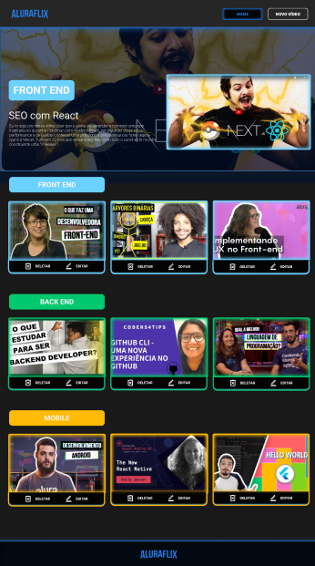

# AluraFlix

Projeto desenvolvido na especialização  Front End React da Alura em parceria com a Oracle para colocar em prática o aprendizado adquirido durante a especialização. Criamos o AluraFlix com o intuito de nos aprofundarmos nos conceitos de CRUD aplicado no React, onde podemos inserir, deletar ou atualizar um vídeo de acordo com sua categoria, sendo as mesmas FRONT END, BACK END OU MOBILE.

## Scripts disponíveis

No diretório do projeto executar:

### `npm start`

Executa o aplicativo no modo de desenvolvimento
Abra [http://localhost:3000](http://localhost:3000) para visualizar no navegador.

A página será recarregada quando você fizer alterações.
Você também pode ver quaisquer erros de lint no console

### `npm run backend`

Para executar o backend da aplicação e mostrar os vídeos registrados e manipulá-los.

## Projeto imagem

